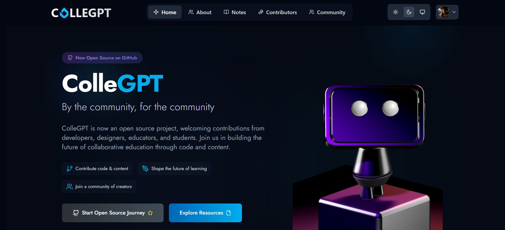

# ColleGPT


ColleGPT is a community-driven platform designed to help students prepare together. Built with the intention of fostering collaborative learning and knowledge sharing, this project aims to create a supportive environment where students can learn, grow, and succeed together.

<figure><figcaption></figcaption></figure>

## 🚀 Features

- **Study Notes & Resources**: Access comprehensive study materials and educational resources
- **Placement Preparation**: Get ready for your career with placement-specific resources and guidance
- **Hackathon Updates**: Stay updated with latest hackathons and coding competitions
- **GATE Exam Resources**: Specialized materials for GATE exam preparation
- **Project Showcase**: Share and discover innovative student projects
- **Educational Videos**: Curated video content for better learning
- **Community Features**: Connect with peers and mentors
- **AI-Powered Learning Assistant**: Get personalized help and guidance
- **Real-time Interaction**: Engage with the community in real-time
- **User-friendly Interface**: Intuitive and responsive design for seamless experience
- Open source contribution

## ��️ Installation

### Frontend Setup

```bash
# Navigate to frontend directory
cd frontend

# Install dependencies
npm install
# OR if you encounter peer dependency issues
npm install --legacy-peer-deps

# Start the development server
npm start
```

### Backend Setup

```bash
# Navigate to backend directory
cd backend

# Install dependencies
npm install

# Start the server
node index
```

## 🤝 Contributing

We welcome contributions from the community! Here's how you can help:

1. Fork the repository
2. Create your feature branch (`git checkout -b feature/AmazingFeature`)
3. Commit your changes (`git commit -m 'Add some AmazingFeature'`)
4. Push to the branch (`git push origin feature/AmazingFeature`)
5. Open a Pull Request

### Pull Request Process

1. Update the README.md with details of changes if needed.
2. Provide proper description and changes.
3. Update the documentation if necessary.

## 📝 Review Process

- Pull requests and issues are reviewed weekly
- We appreciate your patience as we carefully review each contribution

## 📧 Contact

For any questions or updates, please reach out to:

- **Mayank Yadav**
- **Divya Kaurani**

## 🙏 Acknowledgments

Thanks to all contributors who have helped make ColleGPT better!

## 📚 Open Source Contribution Guide

### Repository Structure

This repository contains the following main directories:

- `client/` - Legacy frontend implementation
- `frontend/` - Current frontend (open source available)
- `backend/` - Current backend (open source available)

### Related Repositories

We have created separate repositories for specific features:

1. [GATE Resources](https://github.com/KauraniDivya/ColleGPT-GATE) - GATE exam preparation materials
2. [Placement Resources](https://github.com/KauraniDivya/ColleGPT-Placement) - Placement preparation materials
3. [Hackathons](https://github.com/KauraniDivya/ColleGPT-Hackathon) - Hackathon updates
4. [Projects](https://github.com/KauraniDivya/ColleGPT-Projects) - Projects Showcase

### 🌐 Deployed Links

Access the live versions of our platforms here:

- [ColleGPT Main Platform](https://collegpt.com/)
- [GATE Resources](https://gate.collegpt.com/)
- [Placement Resources](https://jobs.collegpt.com/)
- [Hackathons](https://hackathons.collegpt.com/)
- [Projects Showcase](https://projects.collegpt.com/)

### AI Integration

We are actively looking for contributors interested in AI integration! If you're passionate about AI and want to contribute to making ColleGPT smarter, we'd love to connect with you. Feel free to reach out to discuss potential collaborations and schedule a meeting to explore AI integration possibilities.
